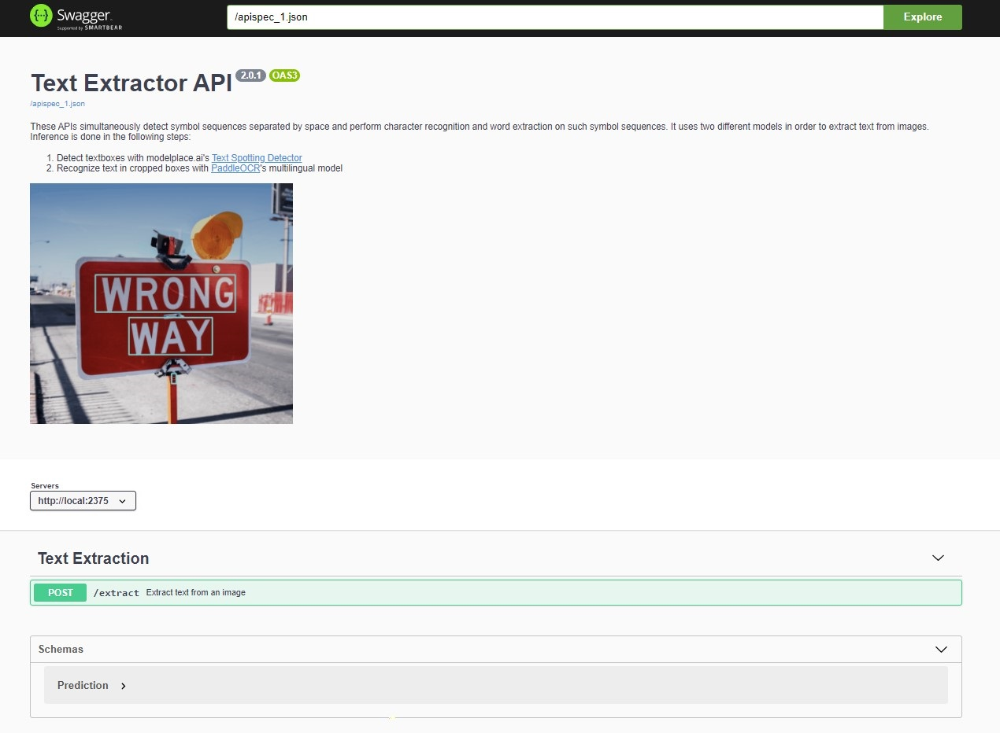
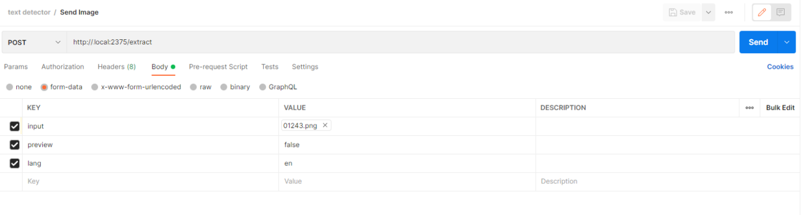

# Text Extractor API




## Send Requests

To send a request via Python:
```python
import json
import requests

img_path = "/path/to/image.jpg" 
response = requests.post(
    f"{self.server}/extract",
    files={"input": open(img_path, "rb").read()},
    data={"lang": "en"}
)
result = json.loads(response.text)
```


To send a request via Postman:




## How to deploy

This server is dockerized, so it can be built and run using docker commands.

### Docker build

```
docker build -f Dockerfile -t text-extractor-api:cpu  .
```
> Only CPU version provided for now

### Run Docker

```
docker run -d -p 2375:80 --restart-always --name text-extractor-api text-extractor-api:cpu
```

Now the server is available at http://``ADDRESS``:2375.
